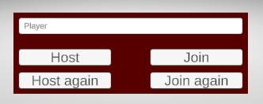

# QuickStart Menu

As simple as it may seem, getting the connection established and being able to host and join games is fundamental. Therefore, I didn't want to rely on hard-coded settings, or even a hard-coded OnGUI. I made this:

.png>)

<figure><figcaption></figcaption></figure>

